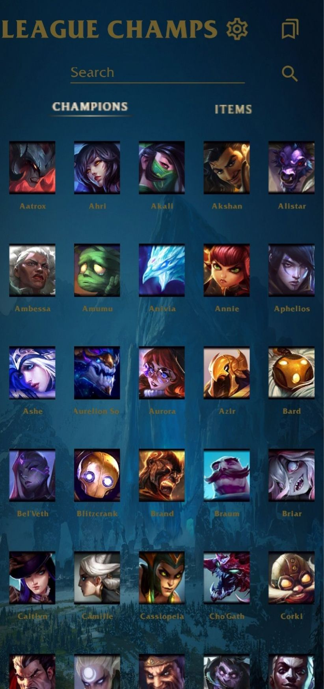
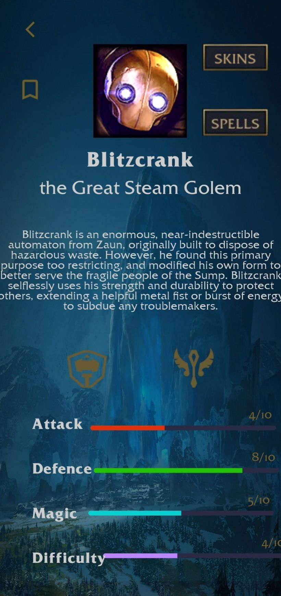
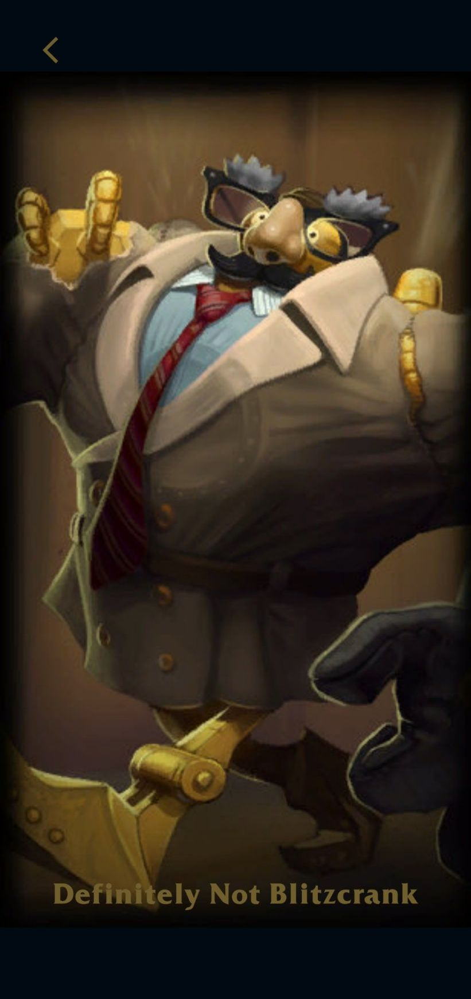
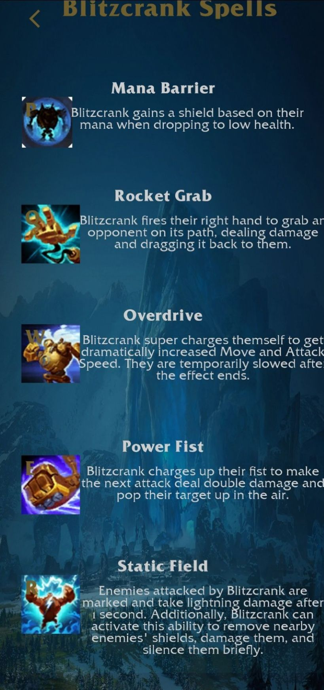

# LeagueChamps

LeagueChamps is an Android application that allows users to explore **League of Legends champions, items, skins, and abilities** through the official Riot API.  
It provides customizable options for **language and version**, a favorites system, and detailed champion information.

---

## 🚀 Features

- Fetches **champions** and **items** from Riot’s API.  
- Supports **multiple languages** and **game versions**.  
- Favorites system for quick access to preferred champions and items.  
- Detailed **champion pages** with:
  - Lore
  - Roles (tags)
  - Stats (attack, defense, magic, difficulty)
  - Skins
  - Spells (abilities + passive)
- **Search functionality** across champions and items.  
- **Responsive UI** that adapts to screen orientation.  

---

## 🛠️ Tech Overview

### Riot API Endpoints Used
- **Champions & Items**
  - `/cdn/{version}/data/{language}/champion.json`
  - `/cdn/{version}/data/{language}/champion/{championName}.json`
  - `/cdn/{version}/data/{language}/item.json`
- **Languages & Versions**
  - `/cdn/languages.json`
  - `/api/versions.json`
- **Images**
  - Champion icons, passive, spells, items, skins (loading & splash)  

Additionally, role icons are fetched from:  
`https://raw.communitydragon.org/10.1/plugins/rcp-fe-lol-hover-card/global/default/roleicon-{tag}.png`

---

## 📱 App Flow

1. **App Start**  
   - Shows a loading screen  
   - Fetches available versions and languages  
   - Loads champions and items  

2. **Main Screen**  
   - Default view: list of champions  
   - Switch between champions and items  
   - Search and favorites filter  
   - Access configuration  

3. **Configuration Screen**  
   - Choose **language** and **version**  
   - Reloads data with selected settings  

4. **Champion Screen**  
   - Shows champion details: name, title, lore, role icons, stats  
   - Options: add/remove favorite, view skins, view spells  

5. **Skins Screen**  
   - Carousel of champion skins (vertical or horizontal)  

6. **Spells Screen**  
   - Displays passive + 4 abilities with descriptions  

---

## 📂 Project Structure

```
leaguechamps/
│── ui/
│   ├── viewModel/LeagueViewModel.kt   # Handles API calls
│   ├── views/                         # UI Fragments
│   │   ├── ListOfChampsFragment.kt
│   │   ├── ConfigFragment.kt
│   │   ├── ChampionFragment.kt
│   │   ├── SkinFragment.kt
│   │   └── SpellsFragment.kt
│   └── adapters/                      # RecyclerView adapters
│       ├── ListOfChampsAdapter.kt
│       ├── ListOfItemsAdapter.kt
│       └── SkinsAdapter.java
│
└── models/                            # Data models
    ├── Champ.kt
    ├── Item.kt
    └── ChampExtra.kt
```

---

## 📸 Screenshots

| Main Screen | Champion Details | Skins Carousel | Spells Page |
|-------------|------------------|----------------|-------------|
|  |  |  |  |

---

## ⚡ Installation & Usage

1. Clone the repository  
   ```bash
   git clone https://github.com/yourusername/LeagueChamps.git
   cd LeagueChamps
   ```
2. Open the project in **Android Studio**  
3. Build and run on an emulator or device  

---

## 📌 Notes

- The app depends on Riot’s Data Dragon API.  
- Extended champion details (skins and spells) require the **extendedChamp()** function to run first.  

---

## 📄 License

This project is intended for **educational and personal use**. Riot’s API and assets are property of **Riot Games**.  
